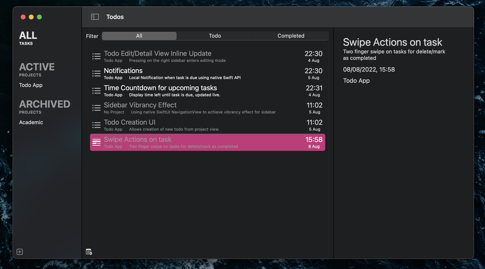

# Tasks

A simple todo list app written in SwiftUI. 

It's only intended as my first hands-on with Swift so features are bare minimal at the moment but I will try to add more stuff.

### Screenshots

### Third party Open Source License

[SymbolPicker](https://github.com/xnth97/SymbolPicker) MIT

